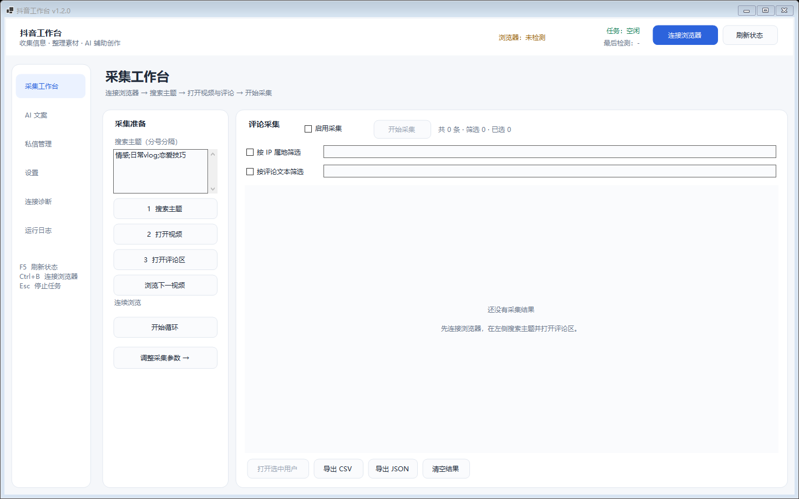

# 抖音工作台 · Douyin Workbench

面向短视频评论整理与文案准备的 Windows 桌面工具。通过可见的专用 Chrome 浏览器采集评论、筛选并导出数据，结合大模型生成候选文案。

当前版本 **v1.2.0**，采用白色圆角卡片界面。本项目使用 AI 辅助开发，包含需求拆解、界面迭代、问题排查与本地验证实践。



## 功能

- **采集工作台**：关键词搜索、视频浏览、评论采集、去重与字段整理。
- **数据整理**：按属地和文本筛选、勾选用户、CSV / JSON 导出。
- **AI 文案**：结合主题、参考模板和最近 20 条评论生成候选文案，人工检查后加入文案池。
- **私信与评论**：维护文案池、发送上限和任务状态；发送需要显式启用。
- **设置与诊断**：参数校验、紧凑表格、窗口大小记忆、连接诊断、运行日志与任务取消。

项目尚未包含用户需求分类、市场分析报告或模型训练功能。模型输出需要人工复核。

## 快速开始

普通使用者可以从本仓库 **Releases** 下载 Windows x64 成品，完整解压后运行 `抖音自动化启动器.exe`。成品包含 Node 和 .NET 运行时，本机仍需安装 Google Chrome。

从源码运行需要 Windows、Chrome、Node.js 22+ 和 .NET SDK 10+：

```powershell
npm ci
npm run launcher
```

进入工作台后连接浏览器并自行登录；随后搜索主题、打开视频和评论区，启用并开始采集。AI 功能需要在设置中填写自己的模型服务和 API Key。

## 构建与验证

```powershell
npm test
dotnet build desktop/DouyinAutomation.Desktop/DouyinAutomation.Desktop.csproj -c Release
dotnet build desktop/DouyinAutomation.Launcher/DouyinAutomation.Launcher.csproj -c Release
npm run product:publish
```

默认成品输出到 `dist/DouyinAutomation`。也可指定独立目录：

```powershell
powershell -NoProfile -ExecutionPolicy Bypass -File scripts/publish-product.ps1 -ProductDirectoryName DouyinAutomation-v1.2.0
```

v1.2.0 本地验证：51 项 Node 测试通过，两个 Release 构建通过；界面覆盖 1440×900、1024×768、920×640 三种窗口尺寸，设置读写和密钥加密通过隔离测试。测试结果不代表所有平台在线操作均已验收，实际发送与付费模型调用未纳入本轮验收。

## 技术结构

```text
C# WinForms 启动器 / 桌面界面
          ↓
Node.js 命令控制层
          ↓
Chrome DevTools Protocol → 专用 Chrome

桌面界面 → 兼容 chat/completions 的模型服务
```

源码分为桌面 UI、应用逻辑、浏览器/CDP 基础设施与本地测试。详细说明见 [使用文档](docs/USAGE.zh-CN.md) 和 [架构说明](docs/ARCHITECTURE.zh-CN.md)。

## 数据与使用边界

- 登录状态保存在本地 `.runtime`；API Key 使用当前 Windows 用户的 DPAPI 加密保存。
- 仓库和发布压缩包不包含登录资料、真实 API Key、本地配置或采集记录。
- 使用 AI 生成时，主题、模板及最近 20 条评论会发送到配置的模型服务。
- 请仅在有权限的场景下使用，并遵守平台规则。该项目与抖音官方无关联。
